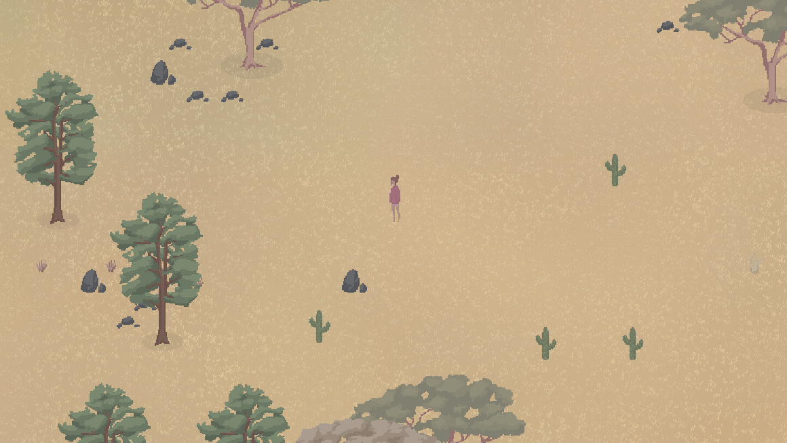
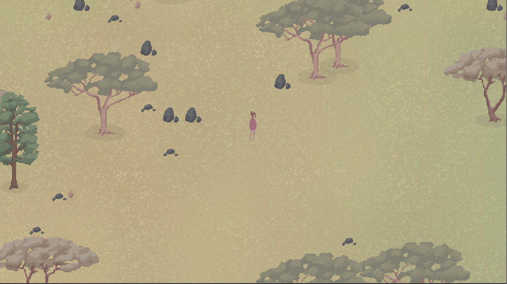
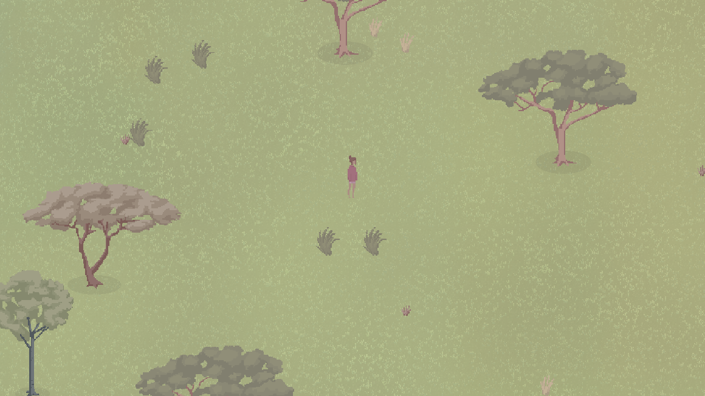
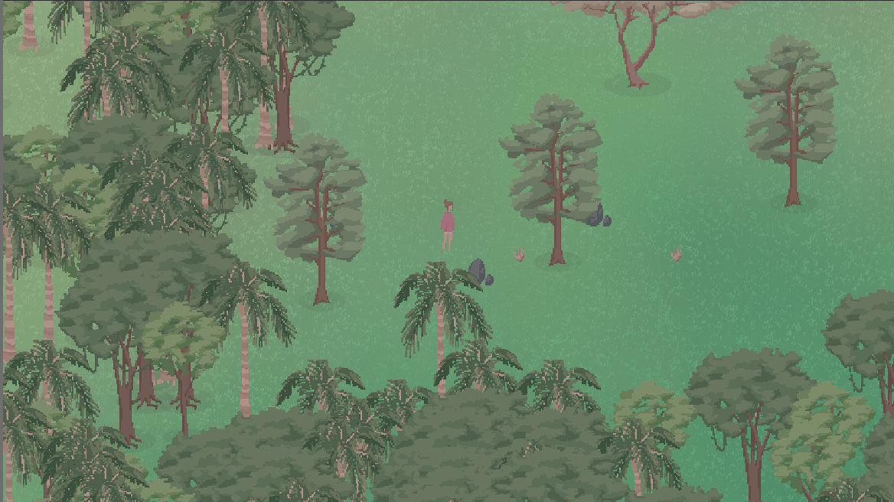
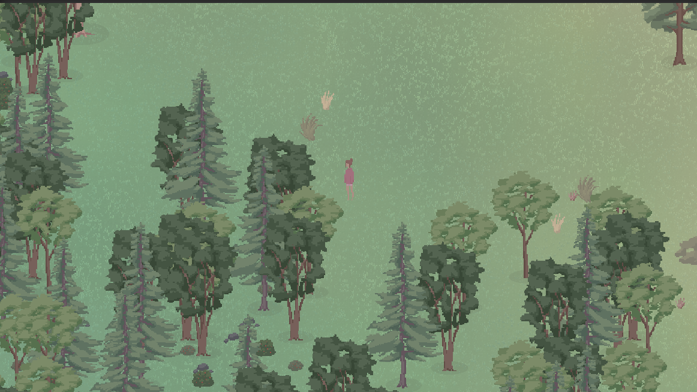
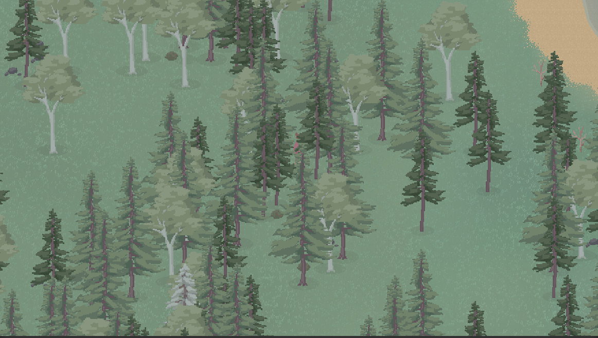
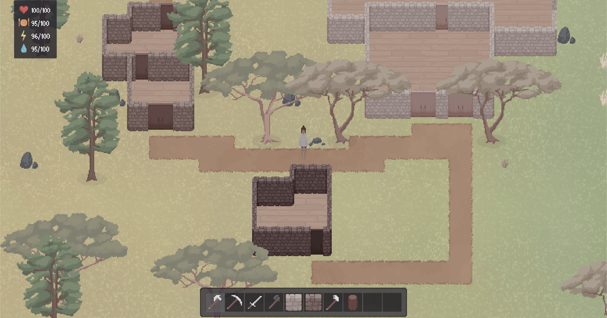
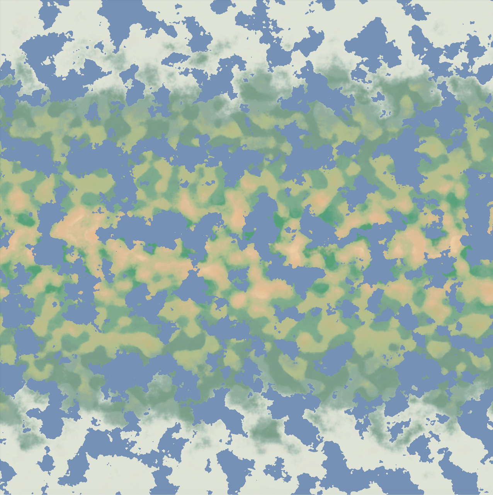
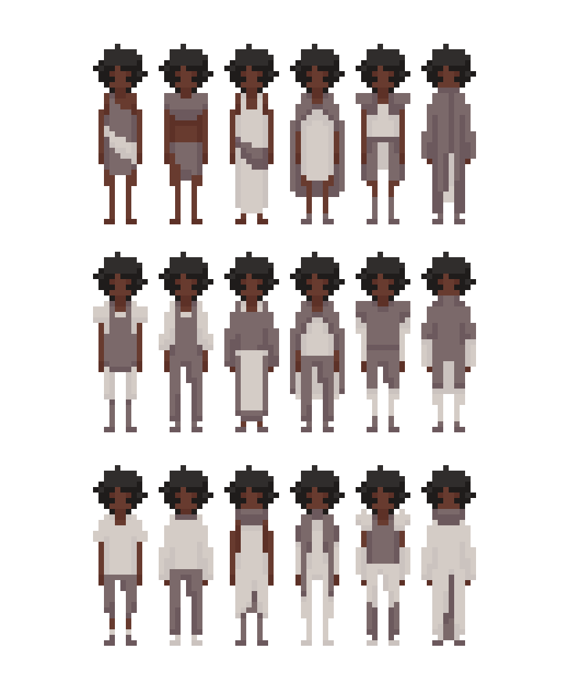

# Interscape: 
An open-world topdown 2D game made in Unity! Uses procedural generation to generate very large maps and worlds that are fun to explore. Still under development; there are many more features that plan to be added. In its current state, the player can walk around, chop trees and pick up items.

Here are some different biomes so far. Biome blending has been implemented in a shader to enable smooth gradient transitions between biomes. 

  
  
  
  
  
  

I am also working on adding buildings, floors and paths. The walls are made from individual tiles of which the player can place or remove as they please. The doors currently slide open/close automatically when the player walks near.

  

And just for fun, here is what the map of a random seed looks like. The warmer biomes generate at the equator and the cooler biomes toward the poles. There are also no large oceans so player travel doesn't get too boring. Layered perlin noise is used for the world generation by creating a heat, moisture and height map.

  

Here's some concept art for the player/npc sprites:

  

## Demos
https://user-images.githubusercontent.com/59108399/179401028-f964b00e-e4ba-4119-9715-b0156890ed87.mp4

https://user-images.githubusercontent.com/59108399/179400807-5d833b31-02e8-4a4b-a3e0-3d2065c934d4.mp4

So far, this has been an entirely solo project. All animation/art is drawn from scratch by Jess in Procreate for iPad. 
Should you have any thoughts or enquires about this project, feel free to send an email to jrhammer50@gmail.com :D
