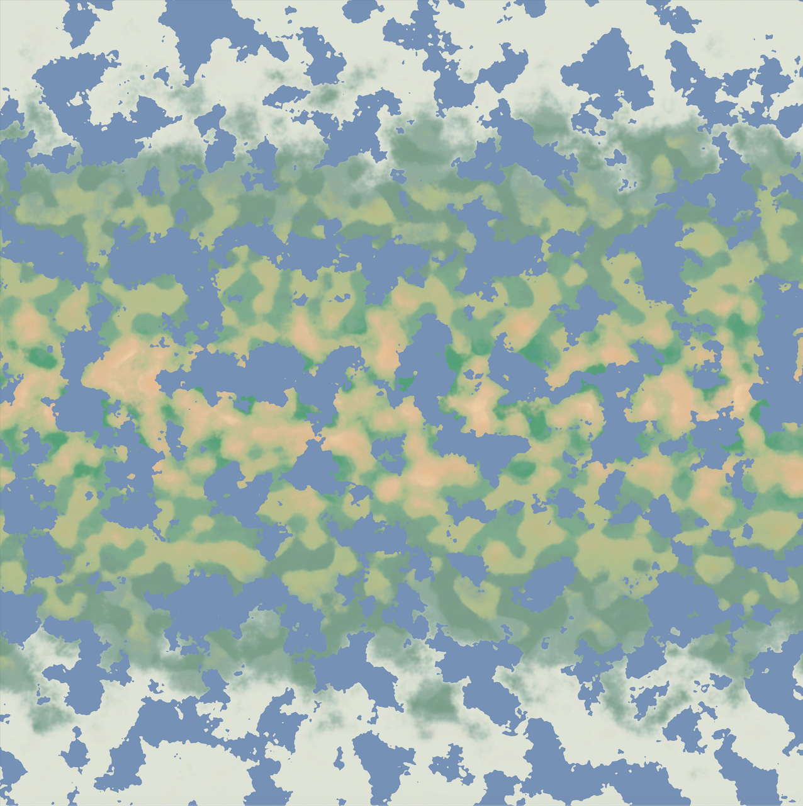

# Interscape: 
An open-world topdown 2D game made in Unity made by Jess for fun. Uses procedural generation to generate very large maps and worlds that are fun to explore. Still under development; there are many major features that are planning to be added.

Some screenshots of some different biomes so far:

  
  
  
  
  
  

Here is some screenshots with UI, all the designs were made from scratch:

  
  

Here is what the map of a random seed looks like:

  

